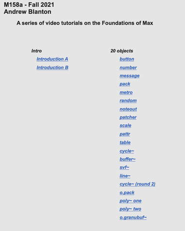
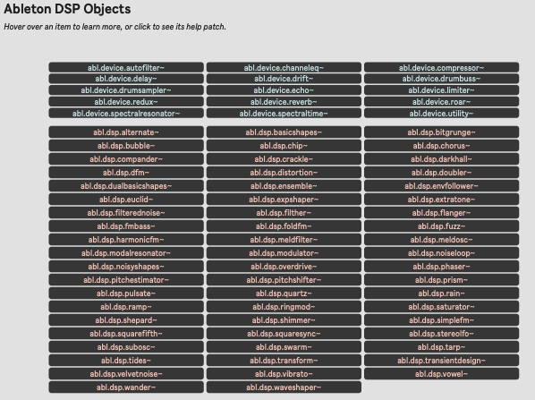

<strong>Andrew Blanton, Max in 20 objects Videos</strong>
1)  In Max 9 (top menu), choose <kbd>Extras</kbd> → <kbd>CNMAT-Pedagogy_Overview</kbd> to open the CNMAT Pedagogy Overview patch.
    
2) In <strong>CNMAT-Pedagogy_Overview</strong>, select <kbd>Courses</kbd> from the top menu tab, then double-click <kbd>blanton-course</kbd>.

  

<strong>Ableton DSP Objects Library (pre-assembled audio effects and signal patches from Ableton Live):</strong>

1) In Max 9 (top menu), choose <kbd>Extras</kbd> → <kbd>Ableton DSP Objects</kbd> to open the Ableton DSP Objects overview. 
2) From <strong>Ableton DSP Objects</strong>, select <kbd>Object listing</kbd> from the middle tab of the top menu. NOTE: these are not especially useful as help patches; it is generally better to try the objects and explore the audio results.

 

<strong>Objects Presented in Class (links to tools, materials and support for objects shown in class)</strong>

  08/16/2026 

