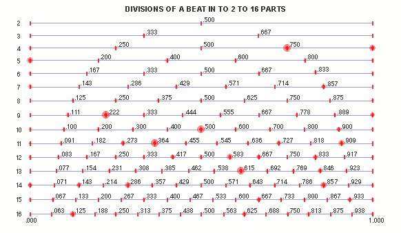
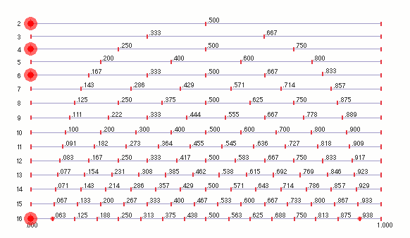
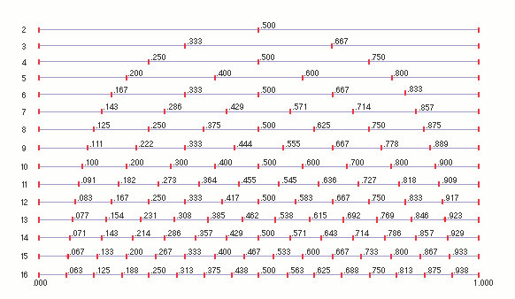
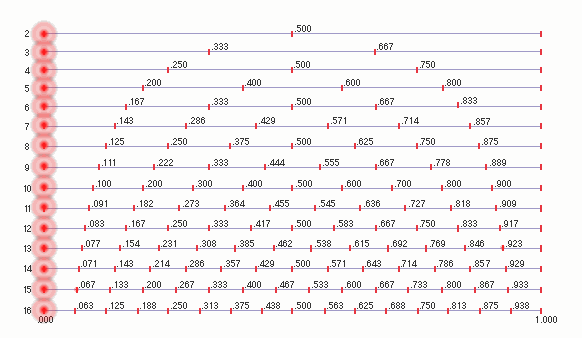

# Music158a Fall 2026 INTRODUCTION

[*(Jump to Fall 2026 Music 158a SYLLABUS)*](SYLLABUS_158a_Fall_2026.md)

In this class, it is OK not to know. Some of us are musicians, from beginner to advanced. Some of us are programmers, from beginner to advanced. Some of us are music lovers who know what they like. Some of us are a little bit of all these things.

Here, those who know something share what they know. If someone insults you or makes you feel unprepared, talk to your professor. Otherwise, ask about it. Depend on your classmates. Please ask!  

What do we mean when we say something is "musical"? 

How can computers and AI assistants deepen our understanding of what we call "musical"?  

How can computational systems designed for musical control expand the ways humans think about and make music with machines?  

In this course, we do not ask whether an audible phenomenon is music or even if we like it; we ask what is musical about a behavior, and how, through iteration, we better control and understand the behavior - make it more musical. We ask, not what is best, but what is better.  

How do we decide which is better?  

 This music technology and sound production course is not centered on the direct imitation of conventional human systems of music making. Instead, we replace our reliance on familiarity (often the basis of how we assess musical behaviors) with inquisitiveness, openness, and testing based on audible feedback and comparison. Music made with musically informed computational systems easily extends beyond imitation of established human practices -- towards an expanded field in which the human "musicality" is overtaken by machine "musicality". But the question remains, is it musical, and how?  

Rather than pursuing fully autonomous music generation, our focus will be on collaborative, semi-autonomous systems, where decision engines and state machines—developed and shaped with the aid of AI coding support, the history of music making with computers at CNMAT, and auditory feedback—lead a student toward new forms of personal musical expression with machines.  

What forms of musical thought become possible when sound, structure, and process are treated as computable materials—some extending beyond the limits of human perception, performance, and cognition? 

When does an algorithm become more than a rule to become a compositional partner, model, or musical agent? 

What kinds of musical knowledge are made explicit when we formalize them computationally? 

What aspects of musical experience resist formalization, quantization, or algorithmic description?

How do feedback, randomness, recursion, emergence, and constraint function musically?

[Syllabus]([[https://github.com/CNMAT/Music158a/blob/main/SYLLABUS_158a_Fall_2026.md](https://github.com/CNMAT/music158a/blob/main/SYLLABUS_158a_Fall_2026.md)]
