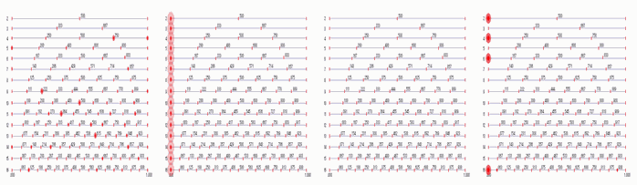

**Music 158A Fall 2026 SYLLABUS**
======================
Department of Music/CNMAT  
Sound and Music Computing with CNMAT Technologies  
###### **[(Jump to Schedule)](#schedule)**

[classschedule]: https://classes.berkeley.edu/search/class?search=music+158a&f%5B0%5D=term%3A8588
Music 158A, Spring 2026  

Instructor: Edmund Campion with GSI Pablo Teutli
Email: campion@berkeley.edu
Class Day/Time: T TR 11:00 am - 12:30 pm
Class Website: https://github.com/CNMAT/music158a2026

Course Description
------------------
Music 158A explores musical topics through computational and AI-assisted tools, with primary emphasis on the Cycling ’74 / Ableton Max/MSP environment. Students will learn the fundamentals of Max/MSP through a sequence of weekly exercises, eventually including the use of Gemini AI as a coding-support tool. The UC Berkeley Center for New Music and Audio Technologies (CNMAT) has developed tools and practices for this kind of work for more than 30 years, and the course will introduce and apply these resources throughout the semester.

The course develops aesthetic, analytical, and technical skills through discussion, empirical study, hands-on experimentation, and collaborative engagement. Balancing artistic and technical concerns, students will deepen their understanding of creative processes involving sound, computation, and musical organization, culminating in a final project and presentation.

Material and required software include: 

Max/MSP monthly subscriptions (4-months at $12.99 per month)
[download max/msp]: https://cycling74.com/products/max
  
GitHub and Max packages Additions (all required and free)
Max Packages/CNMAT Externals (In Max/MSP, go to File/Show Package Manager, then search for CNMAT, then install 'CNMAT externals')
Max Packages/odot (In Max/MSP, go to File/Show Package Manager, then search for odot, then install 'odot by CNMAT')
[GitHub/CNMAT Depot]: https://github.com/CNMAT/CNMAT-MMJ-Depot

Course Goals
-----------------

In this course, we do not ask whether it is music; we ask what is musical about it, and how, through iteration, might we make it more musical -- not what is best, but what is better. Our interests here are not centered on the direct imitation of conventional human systems of music making. Instead, we will work to replace our reliance on familiarity—often the basis of what we think we like in music—with inquisitiveness, openness, and testing based on audible feedback. Music made with musically informed computational systems extends beyond imitation of established human practices -- towards an expanded field in which the human is sometimes overtaken by machine processes. The primary goal is to accomplish a basic understanding of Max/MSP and to complete a final project that demonstrates that understanding and produces a musical outcome.

Final Project Presentations
---------------------------

Music 158a students do not take a  standardized final exam. In lieu of a standardized final exam, students work alone to produce a final project. Final projects will be due at the scheduled exam period and will be presented to the class as a demonstration/performance/installation on or near the final exam date (TBD).

Music 258B students will be required to create a final project appropriate to the graduate level of disciplinary focus. The specifics of the requirement will be discussed and agreed upon by the instructor in consultation with each student. Graduate students from inside and outside the Music Department must be registered for Music 258B (see instructor).

Class Materials
---------------

Music 158B/258B will use the Cycling’74 MaxMSP programming environment extensively. Students must have access to a laptop commuter with MaxMSP, please see the instructor for computer access options. Students may choose to purchase MaMSP, or alternatively, there are student authorization options for under $100 available at cycling74. Lab materials, including software, tangible user interfaces,  sensors, actuators, will be made available to students by the Center for New Music and Audio Technologies throughout the semester. Lab materials are not available for home use. Students will learn techniques for prototyping instrument design away from the lab.

Weekly Lab and Homework Assignments
-----------------------------------

Each week students are assigned a specific paradigm of instrument design to be worked through in groups. Students individually prepare design sketches to be shared and tested with their teammates. Concluding each week is a critique session with the full class, where each group presents their lab work, shares their evaluation, and discusses ideas for future developments.

Grading Policy
--------------

**Class Attendance = 20% total** 
policy: Students are allowed four (4) absences without penalty.  After four absences, each additional absence will result in a 5% drop in your overall grade. 

**Class Participation = 5% total**
policy: Students are expected to ask questions and engage with the professor during the classroom meetings. 

**Class Demonstration for Homework assignments = 5% total**
policy: Every student is required to present once at the front of the class from their own laptop with the results of one of the homework assignments. This short presentation (5-8 min.) is in addition to the final project class demonstration required at the end of the semester.

**Technology and Tools Readiness = 5% total** 
Policy: Students are responsible for maintaining and demonstrating that their laptop working environment is in solid working order at all times. This course features weekly updates and tool sharing on GitHub and/or BCourses.  When a student is given a warning from the instructor or GSI that they are out of compliance or not up to date on tools presented in class, they have one week to resolve and demonstrate the fix to the GSI. The first warning is without penalty.  All future warnings are an automatic 5% deduction from the overall grade.

**Homework Assignments = 40% (8 x 5% each)** 

Policy: There will be eight (8) homework assignments for the semester. Each assignment will be completed using the Max/MSP software tools provided. Submissions for homework are uploaded to the Music 158A Fall 2026 BCourses site by the beginning of class time on the day they are due. 

**Final Project and Performance = 25%** 

The class will conclude with a final student demonstration, performance, and/or sound installation in the CNMAT main room. The final project is a creative work involving sound production and sound organization: a musical work or composition.

The course is designed to provide students with no prior musical background and/or no prior computational experience with a clear pathway toward earning the full 25% allocated to the final project. Final projects must demonstrate both comprehension and application of course concepts, and they should be developed using the materials, methods, and technologies presented in class unless Professor Campion explicitly approves the use of other technologies or programming environments.

The final project will involve both musical and technical considerations. Research and development for the final presentation will begin midway through the semester and will be integrated into the sequence of homework assignments.

--------
## Schedule

| Week                           | Dates and Activities                                                                                                                                                                                                                                                                                                                                       |
| ------------------------------ | ---------------------------------------------------------------------------------------------------------------------------------------------------------------------------------------------------------------------------------------------------------------------------------------------------------------------------------------------------------- |
| **Week 1**                     | **(th)** 08/20 — Introduction to Music 158A  *Assignment: Install Max/MSP. NO CLOUD INSTALLATIONS or Back-ups!!! Windows: no OneDrive. Mac: no iCloud. Students must keep backups of their materials on a flash drive.*|
| **Week 2**                     | **(tu)** 09/01 — MAX/MSP basics and completion of individual student technical installs  **(th)** 09/03 — In-class practice with Max/MSP and Audio out  *Class Requirement: Always bring laptops with a full working environment ready for in-class LAB.*                                                                                                                            |
| **Week 3**                     | **(tu)** 09/08 — Max Control and Timing, Probabilistic Selection Engines, Decision Structures and New Forms of Rhythms (primes, asymmetrical sequences) -- with Audio Samples PT. 1  **(th)** 09/10 — Max Control and Timing, Probabilistic Selection Engines, Decision Structures and New Forms of Rhythms (primes, asymmetrical sequences) -- with Audio Samples PT. 2  *Assignment: Homework_1. All assignments are found in the `Homework_Assignments` folder.*|
| **Week 4**                     | **(tu)** 09/15 — Max Control and Timing, Probabilistic Selection Engines, Decision Structures and New Forms of Rhythms (primes, asymmetrical sequences) -- with with VST~ (synthesizer) PT. 3  **(th)** 09/17 — Max Control and Timing, Probabilistic Selection Engines, Decision Structures and New Forms of Rhythms (primes, asymmetrical sequences) -- CLASS DEMONSTRATIONS  *DUE: Homework_1 due today by midnight. Students are given a chance to present in class today.*                                           |
| **Week 5**                     | **(tu)** 09/22 — Signal, Synthesis and Tone, Mixing, CNMAT Spectral Objects PT. 1  **(th)** 09/24 — Signal, Synthesis and Tone, Mixing, CNMAT Spectral Objects PT. 2  *Assignment: Homework_2. All assignments are found in the `Homework_Assignments` folder.*|
| **Week 6**                     | **(tu)** 09/29 — Signal, Synthesis and Tone, Mixing, CNMAT Spectral Objects, and the Note to Noise Continuum PT. 3  **(th)** 10/01 — Signal, Synthesis and Tone, Mixing, CNMAT Spectral Objects -- CLASS DEMONSTRATIONS  *DUE: Homework_2 due today by midnight. Students are given a chance to present in class today.*                                                                                                                              |
| **Week 7**                     | **(tu)** 10/06 — Spatial Audio, Mixing, SPAT PT. 1  **(th)** 10/08 — Spatial Audio, Mixing, SPAT PT. 2  *Assignment: Homework_3. All assignments are found in the `Homework_Assignments` folder.*|
| **Week 8**                     | **(tu)** 10/13 — Spatial Audio, Mixing, SPAT PT. 3  **(th)** 10/15 — Spatial Audio, Mixing, SPAT --CLASS DEMONSTRATIONS                                                                                                                                |
| **Week 9**                     | **(tu)** 10/20 — Advanced Control and AI-assisted programming (ml.star) with Pitch Spaces (v8.codebox and v8.ui) PT. 1  **(th)** 10/22 — Advanced Control and AI-assisted programming with Markov Chains PT. 2                                                                                                     |
| **Week 10**                    | **(tu)** 10/27 — Advanced Sampling, Event Morphology with Soundfile Descriptors, `vst~` plug-ins, `sfz~` samplers PT. 1  **(th)** 10/29 — Advanced Sampling, Event Morphology, `vst~` plug-ins, `sfz~` samplers PT. 2                                                                                     |
| **Week 11**                    | **(tu)** 11/03 — Advanced Synthesis, Subtractive Synthesis with Inharmonicity and Noise PT. 1  **(th)** 11/05 — Advanced synthesis, Subtractive Synthesis with Inharmonicity and Noise PT. 2                                                   |
| **Week 12**                    | **(tu)** 11/10 — Advanced Spatial Audio with automation, MAX/MSP MC objects PT. 1  **(th)** 11/12 — Advanced Spatial Audio with automation, MAX/MSP MC objects PT. 2                                                                                 |
| **Week 13**                    | **(tu)** 11/17 — Composing with Computers (organization, aesthetics, forms) PT.1   **(th)** 11/19 — Composing with Computers (organization, aesthetics, forms, and production) PT. 2                                                                                                                    |
| **Week 14**                    | **(tu)** 11/24 — Final Project Preperations   **(th)** 11/26(SPRING BREAK)                                                        |
| **Week 15**                    | **(tu)** 12/01 — Final project discussions and in-class programming PT. 1   **(th)** 12/03 — Final project discussions and in-class programming PT.2                                                                                                                                     |
| **Week 16**                    | **12/07–12/11** — Reading Week non-mandatory support LABS for Final Project development                    |
| **Final Project Presentation** | **12/14** — To be discussed     |                                                                            
