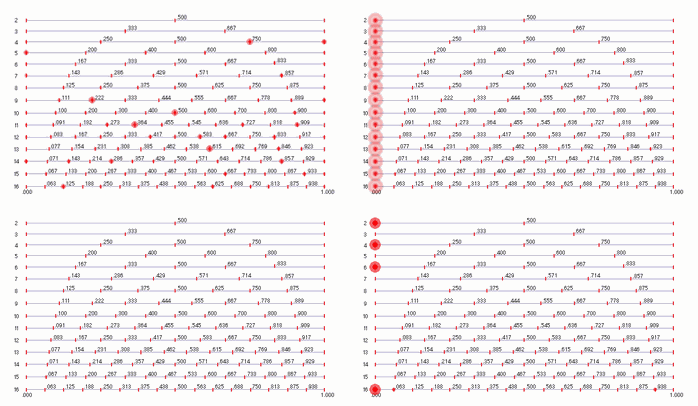

**Music 158A Fall 2026 SYLLABUS**
======================
Department of Music/CNMAT  
Sound and Music Computing with CNMAT Technologies  
[Jump to Schedule](#schedule)

[classschedule]: https://classes.berkeley.edu/search/class?search=music+158a&f%5B0%5D=term%3A8588
Music 158A, Spring 2026  

Instructor: Edmund Campion with GSI Pablo Teutli
Email: campion@berkeley.edu
Class Day/Time: T TR 11:00 am - 12:30 pm
Class Website: https://github.com/CNMAT/music158a

[Syllabus](https://github.com/CNMAT/Music158B_Spring23/blob/master/SYLLABUS.md)
| [Art Resources](https://github.com/CNMAT/Music158B_Spring23/blob/master/RESOURCES.md)
| [Class Website](https://github.com/CNMAT/Music158B_Spring23)

Course Description
------------------
Music 158a will explore musical topics through computational and AI related tools, mainly the cycling74/Ableton Max/MSP package. Students will learn the basics of Max/MSP through a series of weekly exercises, including the use of Gemini AI coding support. UC Berkeley Center for New Music and Audio Technologies (CNMAT)has been developing tools for these purposes for over 30 years and we will introduce and apply these tools throughout the semester. The course builds on developing aesthetic, analytic, and technical skills through discussion, empirical study, and collaborative engagement. With a balance of artistic and technical concerns, participants deepen their understanding of the creative process, demonstrating their work through a final-project, presentation and/pr a public performance. 

Course Goals
-----------------

In this course, we do not ask whether it is music; we ask what is musical about it, and how, through iteration, might we make it more musical -- not what is best, but what is better. Our interests here are not centered on the direct imitation of conventional human systems of music making. Instead, we will work to replace our reliance on familiarity—often the basis of what we think we like in music—with inquisitiveness, openness, and testing based on audible feedback. Music made with musically informed computational systems extends beyond imitation of established human practices -- towards an expanded field in which the human is sometimes overtaken by machine processes. The primary goal is to accomplish a basic understanding of Max/MSP and to complete a final project that demonstrates that understanding and produces a musical outcome.

Final Project Presentations
---------------------------

Music 158a students do not take a  standardized final exam. In lieu of a standardized final exam, students work alone to produce a final project. Final projects will be due at the scheduled exam period and will be presented to the class as a demonstration/performance/installation on or near the final exam date (TBD).

Music 258B students will be required to create a final project appropriate to the graduate level of disciplinary focus. The specifics of the requirement will be discussed and agreed upon by the instructor in consultation with each student. Graduate students from inside and outside the Music Department must be registered for Music 258B (see instructor).

Class Materials
---------------

Music 158B/258B will use the Cycling’74 MaxMSP programming environment extensively. Students must have access to a laptop commuter with MaxMSP, please see the instructor for computer access options. Students may choose to purchase MaMSP, or alternatively, there are student authorization options for under $100 available at cycling74. Lab materials, including software, tangible user interfaces,  sensors, actuators, will be made available to students by the Center for New Music and Audio Technologies throughout the semester. Lab materials are not available for home use. Students will learn techniques for prototyping instrument design away from the lab.

Weekly Lab and Homework Assignments
-----------------------------------

Each week students are assigned a specific paradigm of instrument design to be worked through in groups. Students individually prepare design sketches to be shared and tested with their teammates. Concluding each week is a critique session with the full class, where each group presents their lab work, shares their evaluation, and discusses ideas for future developments.

Grading Policy
--------------

**Critique Engagement = 30%** 

It is required that you attend and participate regularly in critique, this will account for 30% of your grade. The course includes engaged group dialogue and student-led presentations of the assigned labbs along with research materials. Students will be assessed based upon their individual level of engagement in seminar and the quality of student-lead presentations as defined in the grading policy/ rubric below. 

**Lab Assignments = 40% (4 x 10% each)** 

There will be four lab assignments for the semester and they must be submitted on the day they are due. Students will submit links  to code via github and visual documentation of hardware to the coorisponding google slide deck for the lab.

**Final Project and Performance = 30%** 

The class will conclude with a final Performance and installation of works in the CNMAT main room. Final projects and research must demonstrate comprehension of, and engagement with both musicallity and technical working of projects. Research leading to the final presentation will begin halfway through the semester once we are finished with the initial labs.

--------
## Schedule

| Week                       | Dates and Activities                                                                                                                                                                                                       |
| -------------------------- | -------------------------------------------------------------------------------------------------------------------------------------------------------------------------------------------------------------------------- |
| Week 1                     | **(th)** 08/20 — Introduction to Music 158A                                                                                                                                                                                |
| Week 2                     | **(tu)** 09/01 — Technical installations **BRING LAPTOPS with Max/MSP installed! and keep adding text because this is tricky and requires a lot of explanation and misspellings too along with other brick or brack**  **(th)** 09/03 — Demo 1 — Build a Mic then of course we do it all again and the texxt keeps building and being repaired over and over again..                                                                                            |
| Week 3                     | **(tu)** 09/08 — Add Tuesday activity description here. This can be a longer description, and GitHub Markdown will wrap it automatically within the column width.  **(th)** 09/10 — Open Lab Prototype Performance 1 |
| Week 4                     | **(tu)** 09/15 — Demo — Transduction — Drum Solenoids  **(th)** 09/17 — [**Open Performance 1**](https://github.com/CNMAT/Music158B_Spring23/blob/main/Lab_1.pdf)                                                    |
| Week 5                     | **(tu)** 09/22 —   **(th)** 09/24 —                                                                                                                                                                                  |
| Week 6                     | **(tu)** 09/29 —   **(th)** 10/01 —                                                                                                                                                                                  |
| Week 7                     | **(tu)** 10/06 —   **(th)** 10/08 — [**Open Performance 2**](https://github.com/CNMAT/Music158B_Spring23/blob/main/Lab_2.pdf)                                                                                        |
| Week 8                     | **(tu)** 10/13 —   **(th)** 10/15 —                                                                                                                                                                                  |
| Week 9                     | **(tu)** 10/20 —   **(th)** 10/22 — [**Open Performance 3**](https://github.com/CNMAT/Music158B_Spring23/blob/main/Lab_3.pdf)                                                                                        |
| Week 10                    | **(tu)** 10/27 —   **(th)** 10/29 —                                                                                                                                                                                  |
| Week 11                    | **(tu)** 11/03 — Final Proposal Due  **(th)** 11/05 —                                                                                                                                                                |
| Week 12                    | **(tu)** 11/10 — Group Work Session / Workshop  **(th)** 11/12 —                                                                                                                                                     |
| Week 13                    | **(tu)** 11/17 — Possible Open Performance 4 / Group Work Session / Workshop  **(th)** 11/19 —                                                                                                                       |
| Week 14                    | **(tu)** 11/24 — FINAL PROJECT DISCUSSION                                                                                                                                                                                  |
| Week 15                    | **(tu)** 12/01 — Final project discussion, continued   **(th)** 12/03 —                                                                                                                                                                      |
| Week 16                    | **12/07-11** — Reading Week non-mandatory support LABS                                                                                                                                                                                      |
| Final Project Presentation | **12/14** — To be discussed                                                                                                                                                                                                |
